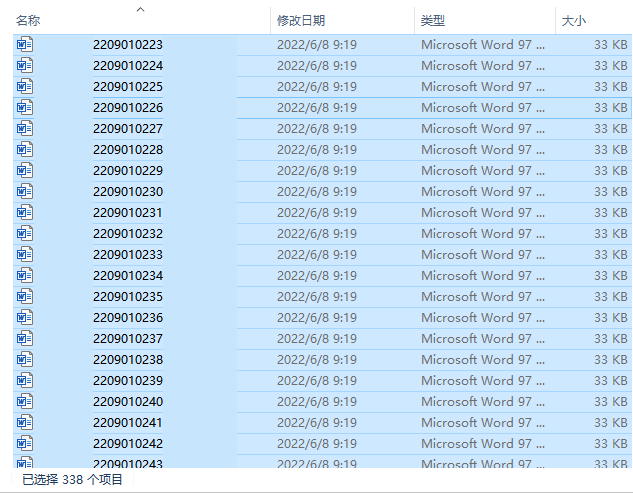

## Word3 批量打印

### 具体需求：
- 连续打印上百个文档，如下图所示

### 实现思路：
1. 通过 Python 获取文件列表
1. 通过 pwin32 打开word程序
1. 调用 VBA 或直接编写打印代码，进行打印

### 解决方法：
- 详见代码

### 特别提示：
- 不要安装WPS
- 不要用WPS来进行此操作
- WPS在执行此操作时，会开起N个程序

### 温馨提示：
- 建议把打印机的打印设置改为【倒序打印】
- 已经安装WPS时，可在程序执行前，先打开word

### 实现效果：
0. 自动化打印
1. 双击脚本即可连续打印上百个文档
2. 期间仅需要偶尔【补纸】
3. 如果你用了WPS，可能会因为WPS同时开了N多个程序而卡死

